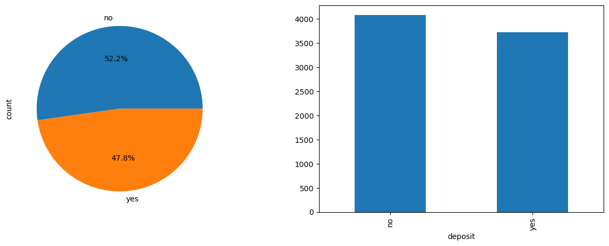
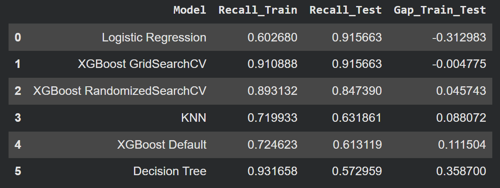
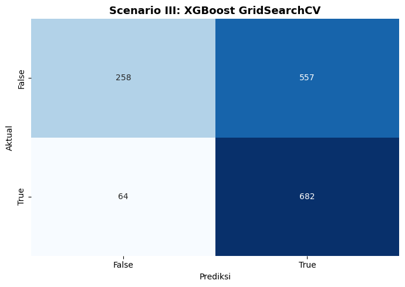
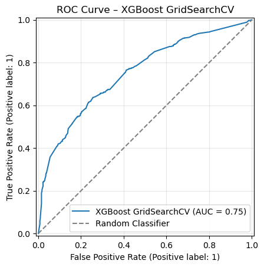
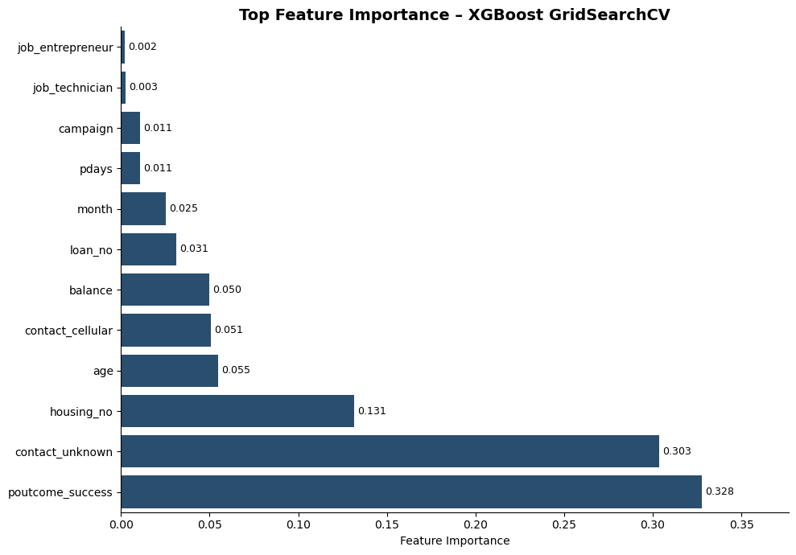
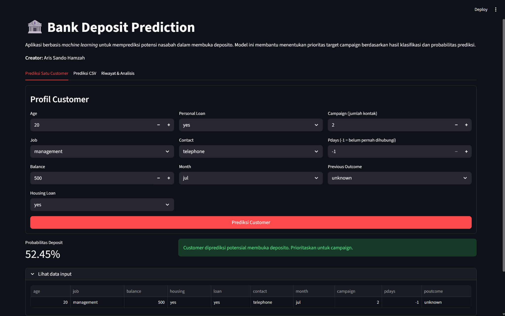
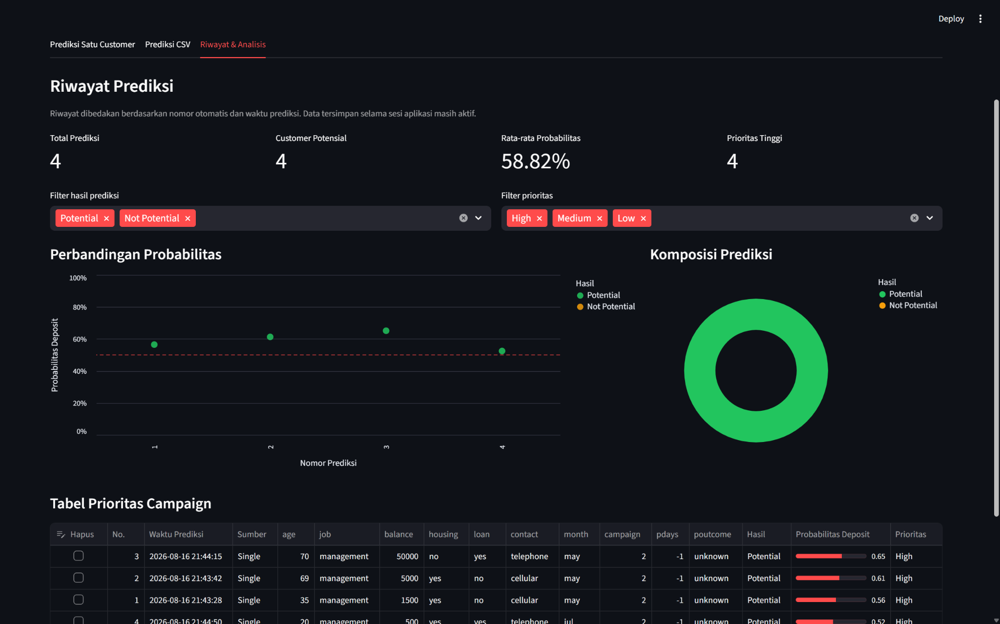

# 🏦 Bank Marketing Campaign: Deposit Prediction


Project *machine learning* untuk memprediksi potensi nasabah membuka deposito. Model membantu bank menyusun prioritas target *telemarketing campaign* berdasarkan hasil klasifikasi dan probabilitas prediksi.

**Creator:** Aris Sando Hamzah

---

## 📌 Daftar Isi

1. [Studi Kasus](#-studi-kasus)
2. [Tujuan Project](#-tujuan-project)
3. [Data dan Target](#-data-dan-target)
4. [Alur Modeling](#️-alur-modeling)
5. [Data Preprocessing](#-data-preprocessing)
6. [Model dan Hyperparameter Tuning](#-model-dan-hyperparameter-tuning)
7. [Hasil Evaluasi](#-hasil-evaluasi)
8. [Business Loss](#-business-loss)
9. [Deployment Streamlit](#-deployment-streamlit)
10. [Struktur Repository](#-struktur-repository)
11. [Cara Menjalankan Aplikasi](#-cara-menjalankan-aplikasi)
12. [Kesimpulan](#-kesimpulan)

---

## 💼 Studi Kasus

Campaign deposito melalui telemarketing membutuhkan biaya, waktu, dan kapasitas tim. Jika seluruh nasabah dihubungi tanpa prioritas, banyak sumber daya dapat digunakan untuk nasabah yang sebenarnya tidak tertarik. Sebaliknya, jika target terlalu dibatasi, bank berisiko melewatkan nasabah yang berpotensi membuka deposito.

Modeling diperlukan untuk mempelajari pola dari data campaign historis dan memperkirakan nasabah yang lebih potensial. Output model tidak menggantikan keputusan bisnis, tetapi menjadi alat bantu untuk:

- menemukan sebanyak mungkin calon nasabah yang berpotensi membuka deposito;
- mengurangi nasabah potensial yang tidak masuk target campaign;
- memberikan urutan prioritas berdasarkan probabilitas prediksi; dan
- membandingkan biaya strategi campaign secara lebih objektif.

Fokus utama project adalah **Recall**, karena kesalahan yang paling ingin ditekan adalah **False Negative**: nasabah diprediksi tidak membuka deposito, padahal aktualnya membuka deposito.

## 🎯 Tujuan Project

### Business objective

Membantu tim campaign mengidentifikasi nasabah potensial secara lebih efektif dan menekan kerugian akibat target campaign yang kurang tepat.

### Machine learning objective

Membangun model klasifikasi dengan recall tinggi untuk kelas deposito, kemudian menerjemahkan hasil prediksi menjadi prioritas campaign yang dapat digunakan melalui aplikasi Streamlit.

## 📊 Data dan Target

Dataset bersih yang digunakan terdiri dari **7.805 observasi**. Target `deposit` dikonversi menjadi Boolean:

- `True`: nasabah membuka deposito;
- `False`: nasabah tidak membuka deposito.

Fitur yang digunakan aplikasi meliputi `age`, `job`, `balance`, `housing`, `loan`, `contact`, `month`, `campaign`, `pdays`, dan `poutcome`.



## ⚙️ Alur Modeling

1. Memahami permasalahan campaign dan menentukan cost of error.
2. Memeriksa kualitas data dan menghapus duplikat.
3. Membagi data secara stratified menjadi train dan test.
4. Menempatkan preprocessing di dalam pipeline untuk mencegah data leakage.
5. Membandingkan beberapa algoritma dengan cross-validation.
6. Melakukan GridSearchCV pada XGBoost dengan scoring recall.
7. Mengevaluasi model final pada test set.
8. Membandingkan tiga skenario Business Loss.
9. Mengekspor full pipeline dan menerapkannya pada Streamlit.

## 🧹 Data Preprocessing

Preprocessing disesuaikan dengan karakter setiap fitur.

| Kelompok fitur | Metode | Alasan utama |
|---|---|---|
| `age` | Mean imputation, MinMaxScaler, PolynomialFeatures degree 2 | Menangani missing value, menjaga rentang terkontrol, dan menangkap pola usia non-linear. |
| `balance` | Median imputation, StandardScaler | Median lebih tahan terhadap outlier; scaling menyetarakan skala numerik. |
| `day` | Most-frequent imputation, KBinsDiscretizer | Hari diperlakukan sebagai kelompok interval, bukan hubungan linear murni. |
| `campaign`, `previous`, `pdays` | Median imputation, RobustScaler | Distribusi cenderung skewed dan mengandung nilai ekstrem. |
| `job` | BinaryEncoder | Mengurangi jumlah kolom dibandingkan one-hot pada kategori yang relatif banyak. |
| `housing`, `loan` | OneHotEncoder | Kategori nominal biner tanpa urutan. |
| `contact`, `poutcome` | OneHotEncoder | Kategori nominal dan tidak memiliki tingkatan. |
| `month` | OrdinalEncoder | Bulan memiliki urutan kalender yang konsisten. |

Seluruh transformer dirangkai menggunakan `ColumnTransformer` dan dimasukkan ke dalam `Pipeline`. Dengan struktur ini, preprocessing pada setiap fold hanya dipelajari dari data training fold tersebut.

## 🤖 Model dan Hyperparameter Tuning

Beberapa algoritma dibandingkan terlebih dahulu menggunakan stratified cross-validation. XGBoost kemudian dipilih dan dituning menggunakan `GridSearchCV` dengan `scoring='recall'`.

Parameter terbaik:

| Hyperparameter | Nilai |
|---|---:|
| `learning_rate` | 0.01 |
| `max_depth` | 3 |
| `n_estimators` | 100 |
| `scale_pos_weight` | 1.5 |

Nilai `scale_pos_weight=1.5` meningkatkan perhatian model terhadap kelas positif. Konsekuensinya, recall meningkat tetapi False Positive juga relatif tinggi.



## 📈 Hasil Evaluasi

| Metrik | Hasil |
|---|---:|
| Recall cross-validation | 91,09% |
| Recall test | 91,42% |
| ROC-AUC test | 75,05% |
| True Negative | 258 |
| False Positive | 557 |
| False Negative | 64 |
| True Positive | 682 |

Recall cross-validation dan test relatif dekat. Hal ini menunjukkan performa model cukup konsisten dan tidak memperlihatkan indikasi overfitting yang berarti.



Kurva ROC menunjukkan kemampuan model membedakan kelas positif dan negatif pada berbagai threshold.



### Feature importance

Feature importance menggambarkan kontribusi relatif fitur terhadap keputusan model. Nilai ini tidak menunjukkan arah pengaruh dan tidak dapat langsung diartikan sebagai hubungan sebab-akibat.



## 💰 Business Loss

Evaluasi bisnis membandingkan tiga strategi:

| Skenario | Strategi | Business Loss |
|---|---|---:|
| I | Tidak ada customer ditelepon | $7.460 |
| II | Semua customer ditelepon | $4.075 |
| III | Menggunakan model | **$3.425** |

Model menghasilkan Business Loss terendah dan menghemat **$650** dibandingkan strategi menghubungi seluruh nasabah. Namun, model masih menargetkan sekitar **79,37%** customer test karena optimasi difokuskan pada recall.

## 🖥️ Deployment Streamlit

Aplikasi memiliki dua menu utama pada sidebar:

1. **Prediksi Customer** — prediksi satu customer atau data CSV.
2. **Riwayat & Analisis** — KPI historis, grafik probabilitas, komposisi prediksi, ranking prioritas, penghapusan data, dan unduh CSV.





Riwayat tersimpan selama sesi Streamlit aktif. Pengguna dapat mengunduh CSV untuk menyimpan hasil secara lokal.

## 📁 Struktur Repository

```text
bank-deposit-prediction/
├── README.md
├── Bank_Marketing_Campaign.ipynb
├── app.py
├── best_model.sav
├── logo.png
├── requirements.txt
├── presentation/
│   └── Bank_Marketing_Capstone_Aris_Sando_Hamzah.pptx
└── images/
    ├── confusion_matrix_model.png
    ├── feature_importance.png
    ├── model_benchmarking.png
    ├── roc_curve.png
    ├── streamlit_history.png
    ├── streamlit_prediction.png
    └── target_distribution.png
```

## 🚀 Cara Menjalankan Aplikasi

1. Clone atau unduh repository.
2. Buat virtual environment.
3. Install dependency:

```bash
pip install -r requirements.txt
```

4. Pastikan `app.py`, `best_model.sav`, dan `logo.png` berada di root repository.
5. Jalankan aplikasi:

```bash
streamlit run app.py
```

> Catatan: file model harus dibuat dan dijalankan dengan versi dependency yang kompatibel dengan environment training.

## ✅ Kesimpulan

XGBoost GridSearchCV mampu menemukan **91,42%** nasabah yang aktualnya membuka deposito. Berdasarkan asumsi Business Loss, model juga memberikan kerugian terendah dibandingkan strategi tanpa campaign dan call-all.

Project ini memperlihatkan bahwa performa statistik perlu diterjemahkan ke konteks operasional. Recall yang tinggi membantu mengurangi nasabah potensial yang terlewat, tetapi trade-off berupa False Positive dan besarnya cakupan campaign tetap perlu dipantau ketika model digunakan.

---

**Creator:** Aris Sando Hamzah
